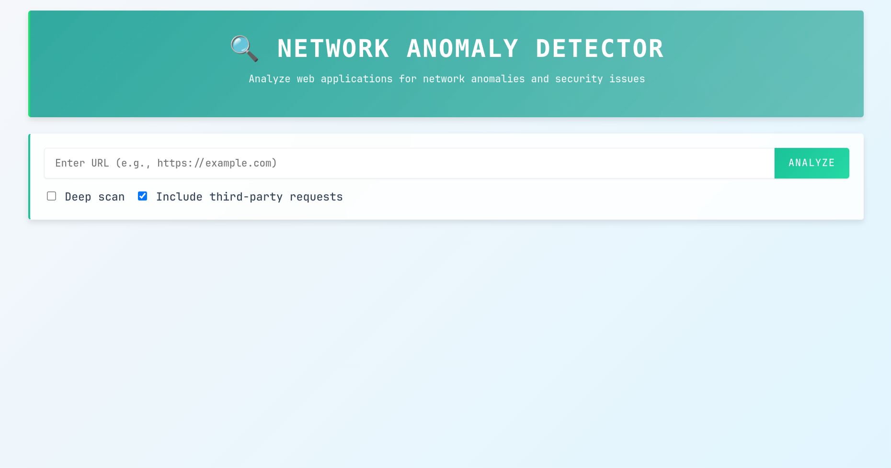
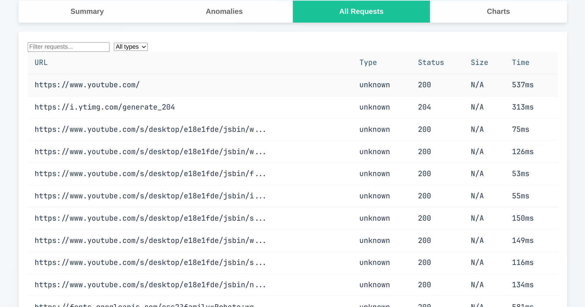
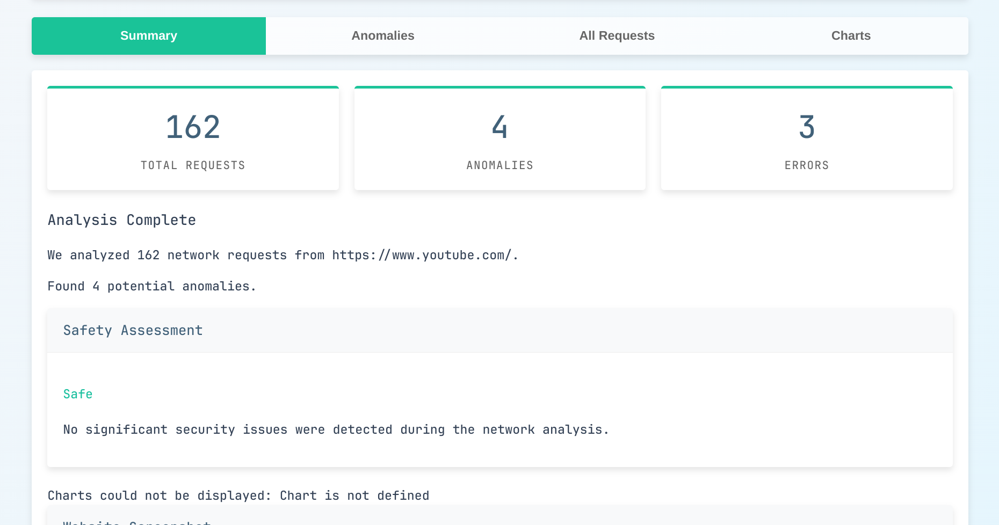
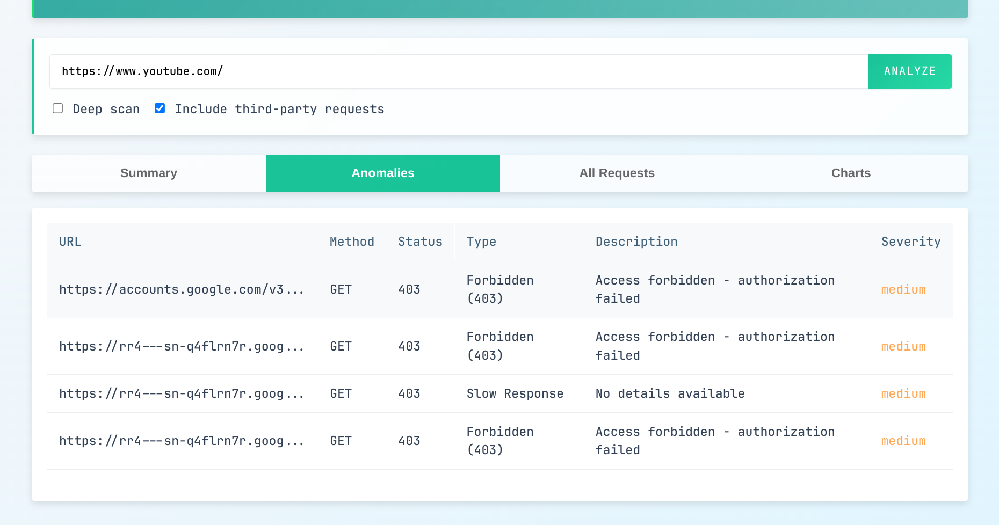

# Network Anomaly Detector

## Overview
This project is a Network Anomaly Detector designed to identify and analyze unusual network activities. It includes a backend for processing network data, a frontend for visualization, and various utilities for scanning and analyzing network logs.

## Features
- **Backend**: Python-based backend for network scanning and anomaly detection.
- **Frontend**: Interactive dashboard for visualizing network anomalies.
- **Data Analysis**: Tools for analyzing network logs and identifying potential threats.

## Screenshots
Below are some screenshots of the frontend:






## Installation
1. Clone the repository:
   ```bash
   git clone <repository-url>
   ```
2. Navigate to the project directory:
   ```bash
   cd network-anomaly-detector
   ```
3. Install dependencies:
   ```bash
   pip install -r requirements.txt
   ```

## Usage
1. Start the backend server:
   ```bash
   python backend/app.py
   ```
2. Open the frontend in your browser:
   ```bash
   http://localhost:5000
   ```

## Contributing
Contributions are welcome! Please fork the repository and submit a pull request.

## License
This project is licensed under the MIT License.